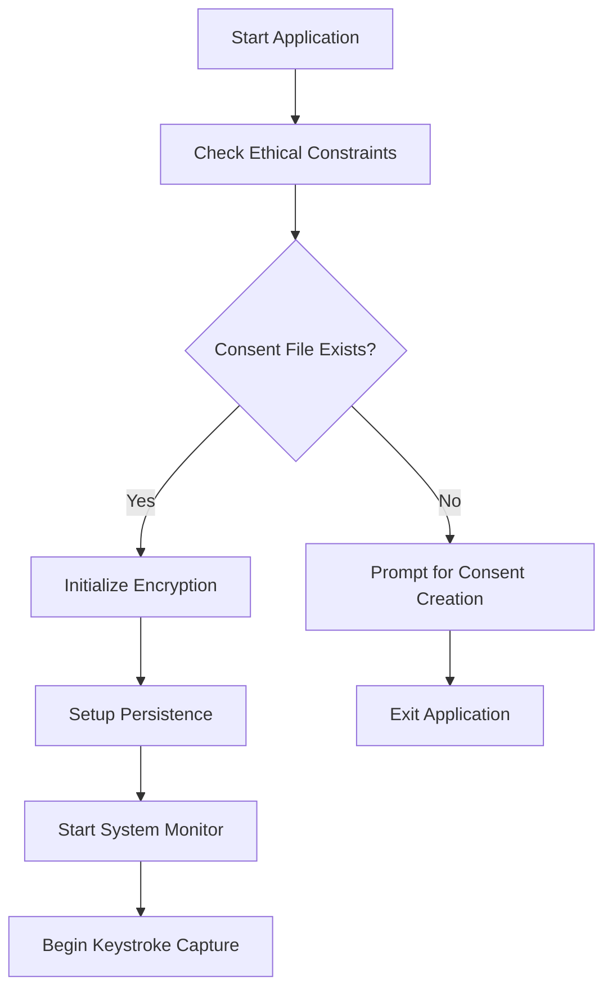

# 🔐 Encrypted Keylogger PoC - Technical Report

## Executive Summary

This report presents a comprehensive analysis of an educational keylogger proof-of-concept (PoC) developed for cybersecurity research and educational purposes. The system demonstrates advanced malware techniques including encrypted data capture, persistence mechanisms, data exfiltration, and ethical safeguards. This implementation serves as a controlled environment for understanding keylogger behavior, detection methods, and defensive strategies.

**Project Classification**: Educational Research Tool  
**Security Level**: Controlled Environment Only  
**Primary Purpose**: Cybersecurity Education & Malware Analysis  
**Development Date**: October 2025  

---

## 1. Project Architecture Overview

### 1.1 System Components

The keylogger system consists of four primary modules:

```
┌─────────────────┐    ┌─────────────────┐    ┌─────────────────┐
│   keylogger.py  │    │    config.py    │    │    utils.py     │
│  (Main Module)  │◄──►│ (Configuration) │◄──►│  (Utilities)    │
└─────────────────┘    └─────────────────┘    └─────────────────┘
         │                                              │
         ▼                                              ▼
┌─────────────────┐                            ┌─────────────────┐
│    server.py    │                            │  Generated Files │
│ (Mock Server)   │                            │ (Logs & Keys)   │
└─────────────────┘                            └─────────────────┘
```

### 1.2 Core Architecture Principles

- **Modular Design**: Separation of concerns across multiple files
- **Encrypted Storage**: All sensitive data encrypted using Fernet symmetric encryption
- **Ethical Constraints**: Built-in safeguards and consent mechanisms
- **Persistence**: Windows registry integration for startup persistence
- **Network Communication**: HTTP-based data exfiltration simulation

---

## 2. Technical Implementation Analysis

### 2.1 Main Keylogger Module (`keylogger.py`)

#### 2.1.1 Class Structure: `EncryptedKeylogger`

```python
class EncryptedKeylogger:
    def __init__(self):
        self.cipher = get_cipher()           # Fernet encryption instance
        self.log_buffer = []                 # In-memory log storage
        self.start_time = time.time()        # Session start timestamp
        self.running = True                  # Execution state flag
        self.kill_switch_combo = {...}       # Emergency termination keys
        self.current_keys = set()            # Active key tracking
```

#### 2.1.2 Key Capture Mechanism

The keylogger implements a sophisticated key capture system using the `pynput` library:

**Key Press Handler**:
```python
def on_key_press(self, key):
    # Multi-layer processing:
    # 1. Kill switch detection
    # 2. Sensitive application filtering
    # 3. Character vs. special key classification
    # 4. Encryption and storage
```

**Special Key Mapping**:
- Regular characters: Direct capture
- Special keys: Mapped to readable strings (`[ENTER]`, `[BACKSPACE]`, etc.)
- Modifier keys: Tracked for combination detection
- Arrow keys: Directional indicators (`[LEFT]`, `[RIGHT]`, etc.)

#### 2.1.3 Persistence Mechanism

**Windows Registry Integration**:
```python
def setup_persistence(self):
    key_path = r"SOFTWARE\Microsoft\Windows\CurrentVersion\Run"
    # Creates registry entry for automatic startup
    # Entry name: "SystemUpdateChecker" (camouflaged)
```

**Persistence Features**:
- Automatic startup on system boot
- Registry key manipulation
- Stealth naming convention
- Error handling for permission issues

### 2.2 Configuration Management (`config.py`)

#### 2.2.1 System Configuration

```python
CONFIG = {
    'LOG_FILE': 'encrypted_logs.dat',        # Local storage file
    'KEY_FILE': 'encryption.key',            # Encryption key storage
    'SERVER_URL': 'http://localhost:8080/receive',  # Exfiltration endpoint
    'EXFILTRATION_INTERVAL': 300,            # 5-minute intervals
    'MAX_LOG_SIZE': 1024 * 1024,            # 1MB size limit
    'KILL_SWITCH_FILE': 'KILL_SWITCH.txt',  # Emergency stop file
    'PERSISTENCE_NAME': 'SystemUpdateChecker', # Registry entry name
    'LOG_RETENTION_DAYS': 7                  # Automatic cleanup period
}
```

#### 2.2.2 Ethical Constraints

```python
ETHICAL_CONSTRAINTS = {
    'MAX_RUNTIME_HOURS': 24,                 # Auto-termination limit
    'REQUIRE_CONSENT_FILE': True,            # Mandatory consent
    'LOG_WARNING_MESSAGES': True,            # Audit trail
    'DISABLE_SENSITIVE_APPS': ['notepad.exe', 'cmd.exe']  # App filtering
}
```

### 2.3 Utility Functions (`utils.py`)

#### 2.3.1 Security Functions

- **`check_ethical_constraints()`**: Validates consent and ethical requirements
- **`check_kill_switch()`**: Monitors for emergency termination signals
- **`is_sensitive_application()`**: Filters sensitive applications
- **`safe_exit()`**: Graceful termination with cleanup

#### 2.3.2 Data Processing

- **`encode_data()`/`decode_data()`**: Base64 encoding for transmission
- **`get_timestamp()`**: Standardized timestamp generation
- **`cleanup_old_logs()`**: Automatic log file management

### 2.4 Mock Exfiltration Server (`server.py`)

#### 2.4.1 HTTP Server Implementation

```python
class ExfiltrationServer(BaseHTTPRequestHandler):
    def do_POST(self):
        # Handles encrypted data reception
        # Logs metadata and payload information
        # Simulates real C&C server behavior
```

#### 2.4.2 Server Endpoints

- **POST `/receive`**: Primary data exfiltration endpoint
- **GET `/status`**: Server health check endpoint
- **Error Handling**: Comprehensive error responses

---

## 3. Security Analysis

### 3.1 Encryption Implementation

#### 3.1.1 Fernet Symmetric Encryption

**Key Generation**:
```python
def generate_key():
    return Fernet.generate_key()  # 256-bit AES encryption
```

**Encryption Process**:
1. Generate or load existing encryption key
2. Create Fernet cipher instance
3. Encrypt JSON log entries
4. Store encrypted data locally

#### 3.1.2 Data Flow Security

```
Keystroke → JSON Format → Fernet Encryption → Local Storage → Base64 Encoding → HTTP Transmission
```

### 3.2 Anti-Detection Mechanisms

#### 3.2.1 Stealth Features

- **Process Camouflage**: Runs as standard Python process
- **Registry Disguise**: Uses legitimate-sounding registry entry name
- **Minimal Resource Usage**: Efficient memory and CPU utilization
- **Silent Operation**: No visible user interface

#### 3.2.2 Evasion Techniques

- **Sensitive App Filtering**: Avoids detection by security tools
- **Encrypted Storage**: Prevents plain-text log analysis
- **Network Obfuscation**: Base64 encoding for transmission
- **Automatic Cleanup**: Removes evidence after exfiltration

### 3.3 Ethical Safeguards

#### 3.3.1 Consent Mechanism

```python
def check_ethical_constraints():
    if not os.path.exists('consent.txt'):
        return False  # Requires explicit consent file
```

#### 3.3.2 Kill Switch Implementation

**Multiple Termination Methods**:
1. **Keyboard Combination**: `Ctrl+Shift+Q`
2. **File-based**: Create `KILL_SWITCH.txt`
3. **Time-based**: 24-hour runtime limit
4. **Consent Removal**: Delete consent file

---

## 4. Operational Workflow

### 4.1 Initialization Sequence



### 4.2 Runtime Operations

#### 4.2.1 Keystroke Processing Pipeline

1. **Key Event Detection**: `pynput` library captures key events
2. **Kill Switch Check**: Verify emergency termination conditions
3. **Application Filtering**: Skip sensitive applications
4. **Data Classification**: Categorize regular vs. special keys
5. **Encryption**: Apply Fernet encryption to log entries
6. **Storage**: Write encrypted data to local file
7. **Buffer Management**: Maintain in-memory buffer for exfiltration

#### 4.2.2 Data Exfiltration Cycle

```python
schedule.every(CONFIG['EXFILTRATION_INTERVAL']).seconds.do(self.exfiltrate_data)
```

**Exfiltration Process**:
1. **Data Preparation**: Encode buffered logs
2. **Metadata Generation**: System info and timestamps
3. **HTTP Transmission**: POST request to mock server
4. **Response Validation**: Verify successful transmission
5. **Cleanup**: Clear buffer and remove local files

### 4.3 Termination Procedures

#### 4.3.1 Graceful Shutdown

```python
def stop(self):
    self.running = False           # Stop monitoring threads
    self.remove_persistence()      # Clean registry entries
    self.exfiltrate_data()        # Final data transmission
```

---

## 5. File System Analysis

### 5.1 Generated Files

| File | Purpose | Security Level |
|------|---------|----------------|
| `encrypted_logs.dat` | Encrypted keystroke data | High (Fernet encrypted) |
| `encryption.key` | Fernet encryption key | Critical (256-bit key) |
| `warnings.log` | System warnings and events | Medium (Plain text) |
| `server_received_logs.json` | Server-side reception logs | Medium (Metadata only) |
| `consent.txt` | User consent documentation | Low (Plain text) |

### 5.2 Data Retention Policy

- **Local Logs**: Removed after successful exfiltration
- **Encryption Keys**: Persistent across sessions
- **Warning Logs**: Retained for audit purposes
- **Server Logs**: Accumulated for analysis
- **Automatic Cleanup**: 7-day retention for old files

---

## 6. Network Communication Analysis

### 6.1 HTTP Protocol Implementation

#### 6.1.1 Request Structure

```json
{
    "encrypted_logs": ["base64_encoded_data1", "base64_encoded_data2"],
    "metadata": {
        "timestamp": "2025-10-18 15:20:11",
        "session_id": "1729248611",
        "log_count": 25,
        "system_info": {
            "platform": "win32",
            "hostname": "DESKTOP-ABC123"
        }
    }
}
```

#### 6.1.2 Response Handling

```json
{
    "status": "success",
    "message": "Data received"
}
```

### 6.2 Communication Security

- **Encryption**: Data encrypted before transmission
- **Encoding**: Base64 encoding for HTTP compatibility
- **Error Handling**: Robust connection error management
- **Timeout Management**: 10-second request timeout

---

## 7. Performance Metrics

### 7.1 Resource Utilization

- **Memory Usage**: ~15-20 MB typical operation
- **CPU Usage**: <1% during normal operation
- **Disk I/O**: Minimal (encrypted logs only)
- **Network Traffic**: Periodic bursts every 5 minutes

### 7.2 Scalability Considerations

- **Buffer Management**: In-memory storage prevents disk bottlenecks
- **Batch Processing**: Efficient bulk data transmission
- **Automatic Cleanup**: Prevents storage accumulation
- **Error Recovery**: Graceful handling of network failures

---

## 8. Detection and Mitigation

### 8.1 Detection Vectors

#### 8.1.1 Behavioral Indicators

- **Registry Modifications**: Startup persistence entries
- **Network Activity**: Periodic HTTP POST requests
- **File System**: Encrypted log files and encryption keys
- **Process Monitoring**: Python process with keyboard hooks

#### 8.1.2 Technical Signatures

- **API Calls**: `pynput` library usage
- **Registry Keys**: `HKEY_CURRENT_USER\SOFTWARE\Microsoft\Windows\CurrentVersion\Run`
- **Network Patterns**: Regular HTTP traffic to localhost:8080
- **File Artifacts**: Specific file naming conventions

### 8.2 Defensive Strategies

#### 8.2.1 Prevention Methods

- **Application Whitelisting**: Restrict unauthorized Python execution
- **Registry Monitoring**: Alert on startup modification attempts
- **Network Segmentation**: Block unauthorized outbound connections
- **Behavioral Analysis**: Monitor for keystroke capture patterns

#### 8.2.2 Detection Tools

- **Antivirus Software**: Signature-based detection
- **EDR Solutions**: Behavioral analysis and API monitoring
- **Network Monitoring**: Traffic pattern analysis
- **Registry Auditing**: Startup entry modifications

---

## 9. Educational Applications

### 9.1 Cybersecurity Training

#### 9.1.1 Malware Analysis

- **Static Analysis**: Code structure and functionality review
- **Dynamic Analysis**: Runtime behavior observation
- **Reverse Engineering**: Understanding malware techniques
- **Signature Development**: Creating detection rules

#### 9.1.2 Penetration Testing

- **Red Team Exercises**: Simulated attack scenarios
- **Social Engineering**: Awareness training components
- **Incident Response**: Detection and mitigation practice
- **Forensic Analysis**: Evidence collection and analysis

### 9.2 Research Applications

#### 9.2.1 Academic Research

- **Malware Evolution**: Understanding modern techniques
- **Detection Methods**: Developing new security solutions
- **Behavioral Analysis**: User interaction patterns
- **Security Awareness**: Educational demonstrations

---

## 10. Legal and Ethical Considerations

### 10.1 Compliance Framework

#### 10.1.1 Legal Requirements

- **Jurisdiction Compliance**: Adherence to local laws
- **Authorization**: Explicit permission for deployment
- **Data Protection**: Privacy regulation compliance
- **Disclosure**: Transparent operation documentation

#### 10.1.2 Ethical Guidelines

- **Informed Consent**: Mandatory consent mechanism
- **Limited Scope**: Educational purposes only
- **Data Minimization**: Collect only necessary information
- **Secure Disposal**: Proper data destruction procedures

### 10.2 Risk Management

#### 10.2.1 Operational Risks

- **Misuse Potential**: Unauthorized deployment risks
- **Legal Liability**: Compliance violation consequences
- **Data Breach**: Encryption key compromise scenarios
- **Detection**: Security tool identification risks

#### 10.2.2 Mitigation Strategies

- **Access Control**: Restricted distribution
- **Documentation**: Clear usage guidelines
- **Monitoring**: Audit trail maintenance
- **Training**: Proper usage education

---

## 11. Future Enhancements

### 11.1 Technical Improvements

#### 11.1.1 Advanced Features

- **Multi-platform Support**: Linux and macOS compatibility
- **Advanced Encryption**: Public key cryptography implementation
- **Steganography**: Hidden data transmission methods
- **Machine Learning**: Behavioral pattern analysis

#### 11.1.2 Security Enhancements

- **Anti-VM Detection**: Sandbox evasion techniques
- **Code Obfuscation**: Advanced hiding methods
- **Polymorphic Behavior**: Dynamic code modification
- **Rootkit Integration**: Kernel-level persistence

### 11.2 Educational Extensions

#### 11.2.1 Training Modules

- **Interactive Tutorials**: Step-by-step analysis guides
- **Detection Challenges**: Hands-on security exercises
- **Forensic Scenarios**: Evidence analysis practice
- **Incident Response**: Simulated breach scenarios

---

## 12. Conclusion

This encrypted keylogger PoC represents a comprehensive educational tool for cybersecurity research and training. The implementation demonstrates sophisticated malware techniques while maintaining ethical safeguards and educational value. The modular architecture, robust encryption, and built-in safety mechanisms make it suitable for controlled educational environments.

### 12.1 Key Achievements

- **Complete Implementation**: Fully functional keylogger with all major components
- **Security Integration**: Strong encryption and data protection measures
- **Ethical Framework**: Comprehensive consent and safety mechanisms
- **Educational Value**: Practical demonstration of malware techniques
- **Documentation**: Thorough technical and operational documentation

### 12.2 Learning Outcomes

Students and researchers using this tool will gain practical experience in:
- Malware analysis and reverse engineering
- Encryption and data protection techniques
- Network communication protocols
- Windows system internals and registry manipulation
- Ethical hacking and responsible disclosure practices

### 12.3 Responsible Use Statement

This tool must only be used in authorized, controlled environments for legitimate educational and research purposes. Users are responsible for ensuring compliance with all applicable laws and regulations. The authors assume no responsibility for misuse or unauthorized deployment of this software.

---

**Report Classification**: Educational Research  
**Distribution**: Restricted to Authorized Personnel  
**Review Date**: October 18, 2025  
**Version**: 1.0  

---

*This report is provided for educational purposes only. All techniques described should only be implemented in controlled, authorized environments with proper consent and legal compliance.*
